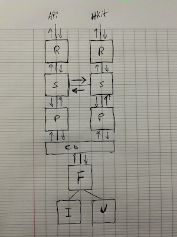

# Goal Tracker
### Architecture

I though a lot about what kind of architecture to go for. 
For time constraints i have settled for one i worked with a while back for a Mail app, that is both quick and clean.

This is a picture i thought would allow you to understand it quicker.
_The key is that we should always interact with the Storage, as our source of tuth for everything._

     
#### Domain
The Domain is where the Data is managed and the logic lives. It is splitted into 4 Parts. Services, Repositories, Persistence, Data Stack.

- Repositories [R]

     They are responsible to communicate with the external data providers to fetch data into the app. 
     For example HealthKit, GoogleFi, Api Server...
     This is the extent of their responsiblity. Fetch data, retrurn it to Service.
     
- Services [S]

     Services is mostly where the logic lies. However they are stateless and only responsible to fetch data from the Repository and store it in the Persistence.
     It is also responsible to build (or proxy the build of) things to be used by external consumers.
     Services can be split into multiple interfaces and files. In this app i am using one file.
     
- Persistence [P]
     
     This is the layer that is responsible to Persist the data. It communicates with the CoreDataStack to Save/Encode, then Fetch/Decode the data.
     It can also contain some logic around storing the data.
     
- CoreData Stack [CD]
      
     Is the warpper around CoreData. I am using one core data stack, but maybe this app could benefit from multiple stacks in the future for additional    functionalities.

- Fetch Controllers [F]

     These are requested by the Interactors/Usecases via the Service and gets built by the Persistence to fetch data. 
     The consumers only interact with a protocol abstraction of the fetch controller. (ex: GoalFetching)
     
- Usecases [U]

     There are no use cases in this app.

- Tracker [T] (not shown in image)
     
     In this application, we need a way to continuously fetch records from external data providers; however, we also dont want long running services globaly.
     
     A Tracker, which is a light weight non-long running operation that gets built by the Service and internally has access to the Persistence and requires Fetch Controllers. 
     
     As the name suggest, they Track changes in the DataStack and react to them, then writes back to the stack, where some other Tracker can pick it up and do their own logic. This helps us in separating logic by listening to changes and reacting to them in another tracker or UI(fetch controller).
     
     For example whenever a new HealthData record is written to the stack, the tracker picks it up (using a FetchController) and updates the Goal's progress for example. Then a _GoalFetching_ receives the change via its FetchController and updates the UI.

#### Queues

Each layer in the Domain has its own Queue it operates on.

Tracker Queue, Repository Queue, Service Queue, Persisting Queue.

More queues can be created, but they target these main 5 queues.

